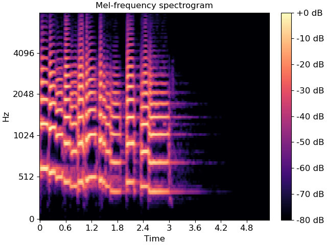

# Audio Analyzer

---

## Preprocessing

---
├─ Trim silence (detect where singing starts/ends) 
├─ Noise reduction (spectral subtraction) 
└─ Normalize loudness  

    <strong id="1">
        Details : 
    </strong>

### Trimming silence

---
Trimming silence means removing low-energy (near-zero amplitude) sections from the beginning and end of an audio signal.
 In waveform terms:
    
    Silence = very low amplitude values

We detect regions below a threshold (in dB) and cut them out

---

### mel Spectrogram

---
<table>
  <tr>
    <td width="30%">
      
    </td>
    <td>
      A <strong>Mel-scaled spectrogram</strong> is a visual representation of audio that maps frequencies 
      to the <strong>Mel scale</strong>, which mimics human hearing by prioritizing lower frequencies.  
      It is a standard tool in AI audio tasks, converting sound into images 
      (time vs. Mel frequency) and often using <strong>decibel scales</strong> for amplitude.
    </td>
  </tr>
</table>

---

### Noise Reduction

---
Noise reduction is the process of removing unwanted background sounds (fan noise, room hum, mic hiss, street noise) while preserving the vocal signal.
 In signal terms:

    Audio = Voice + Noise

Goal → Estimate Noise , and subtract or suppress it.
 We do this through a method called **_Spectral Subtraction_**.

*Spectral subtraction : 
    
    Estimate noise from silent portion
    Reduce frequencies below threshold
---

### Normalize Loudness

---
Loudness normalization means adjusting the amplitude of an audio signal to a consistent level across recordings.

After normalization:

    Feature distributions become consistent
    Training becomes more stable

---